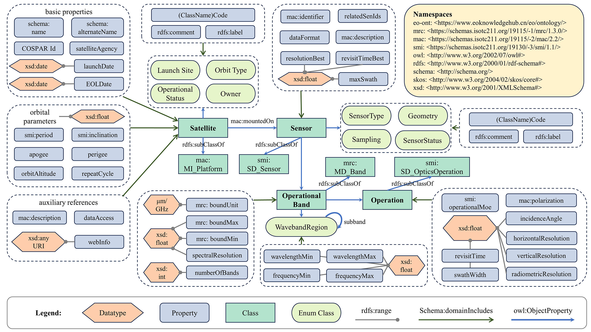
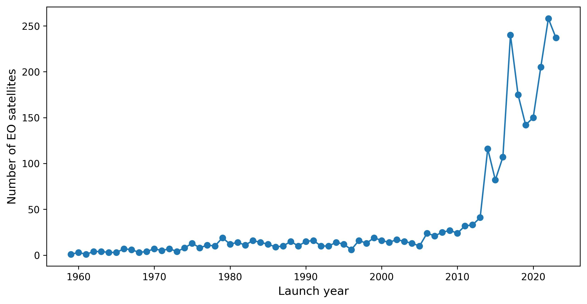
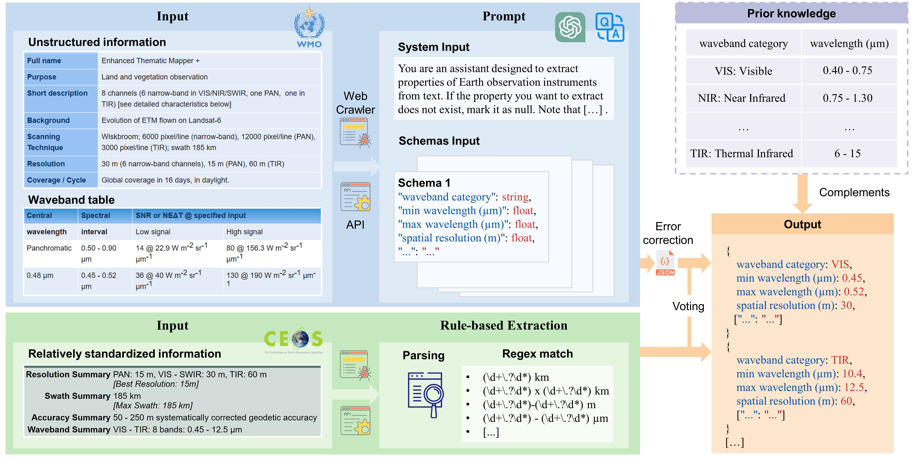

# GEOSatDB: global civil earth observation satellite semantic database

[**English**](./README.md) | [**中文**](./README_CN.md)

GEOSatDB is a semantic representation of Earth observation satellites and sensors that can be used to easily discover available Earth observation resources for specific research objectives.

## Background

The widespread availability of coordinated and publicly accessible Earth observation (EO) data empowers decision-makers worldwide to comprehend global challenges and develop more effective policies. Space-based satellite remote sensing, which serves as the primary tool for EO, provides essential information about the Earth and its environment by measuring various geophysical variables. This contributes significantly to our understanding of the fundamental Earth system and the impact of human activities.

Over the past few decades, many countries and organizations have markedly improved their regional and global EO capabilities by deploying a variety of advanced remote sensing satellites. The rapid growth of EO satellites and advances in on-board sensors have significantly enhanced remote sensing data quality by expanding spectral bands and increasing spatio-temporal resolutions. However, users face challenges in accessing available EO resources, which are often maintained independently by various nations, organizations, or companies. As a result, a substantial portion of archived EO satellite resources remains underutilized. Enhancing the discoverability of EO satellites and sensors can effectively utilize the vast amount of EO resources that continue to accumulate at a rapid pace, thereby better supporting data for global change research.

## Methodology

This study introduces GEOSatDB, a comprehensive semantic database specifically tailored for civil Earth observation satellites. The foundation of the database is an ontology model conforming to standards set by the International Organization for Standardization (ISO) and the World Wide Web Consortium (W3C). This conformity enables data integration and promotes the reuse of accumulated knowledge. Our approach advocates a novel method for integrating Earth observation satellite information from diverse sources. It notably incorporates a structured prompt strategy utilizing a large language model to derive detailed sensor information from vast volumes of unstructured text.

## Dataset Information

Please note that all versions of the dataset are hosted on [ScienceDB](https://doi.org/10.57760/sciencedb.11805). The downloadable files in RDF Turtle format are located in the data directory and contain a total of 130,134 statements:

- GEOSatDB_ontology.ttl: Ontology modeling of concepts, relations, and properties.
- satellite.ttl: 2,417 Earth observation satellites and their associated entities.
- sensor.ttl: 1,032 Earth observation sensors and their associated entities.
- sensor2satellite.ttl: relations between Earth observation satellites and sensors.

In addition, a [user-friendly portal](http://www.geosatdb.cn) is under development to facilitate easy access to GEOSatDB. The portal currently offers preliminary SPARQL query functionality, enabling the execution of [SPARQL query examples](./query/query_example.md).

GEOSatDB undergoes quarterly updates, involving the addition of new satellites and sensors, revisions based on expert feedback, and the implementation of additional enhancements.

## Relevant Papers

Ming Lin, Meng Jin, Juanzi Li & Yuqi Bai (2024) GEOSatDB: global civil earth observation satellite semantic database, Big Earth Data, DOI: [10.1080/20964471.2024.2331992](https://doi.org/10.1080/20964471.2024.2331992)