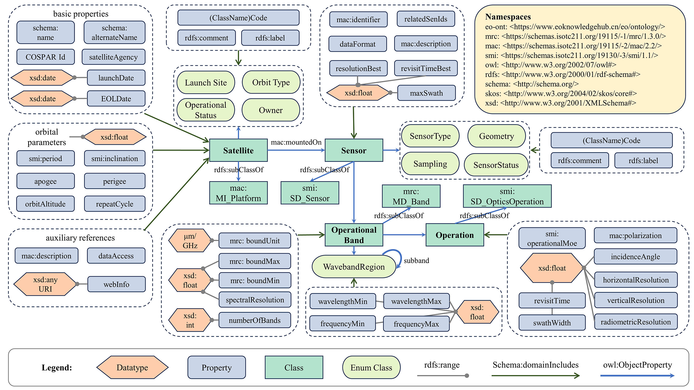

# GEOSatDB: global civil earth observation satellite semantic database

GEOSatDB is a semantic representation of Earth observation satellites and sensors that can be used to easily discover available Earth observation resources for specific research objectives.

## Background

The advancement of satellite remote sensing technology has transformed our capacity to monitor and address global challenges. This technology provides global coverage, frequent observation revisits, and consistent monitoring, thus providing critical data support. Since the first Earth observation satellite was launched in the 1960s, more than a thousand Earth observation satellites have been deployed by various countries and organizations. However, the substantial accumulation of Earth observation assets is maintained independently by different organizations using varying methodologies. This poses a significant challenge in effectively utilizing and maximizing the value of these global observation resources.

## Methodology

This study introduces GEOSatDB, a comprehensive semantic database specifically tailored for civil Earth observation satellites. The foundation of the database is an ontology model conforming to standards set by the International Organization for Standardization (ISO) and the World Wide Web Consortium (W3C). This conformity enables data integration and promotes the reuse of accumulated knowledge. Our approach advocates a novel method for integrating Earth observation satellite information from diverse sources. It notably incorporates a structured prompt strategy utilizing a large language model to derive detailed sensor information from vast volumes of unstructured text.

## Dataset Information

Please note that all versions of the dataset are hosted on [ScienceDB](https://doi.org/10.57760/sciencedb.11805).The downloadable files in RDF Turtle format are located in the data directory and contain a total of 130,134 statements:

- GEOSatDB_ontology.ttl: Ontology modeling of concepts, relations, and properties.
- satellite.ttl: 2,365 Earth observation satellites and their associated entities.
- sensor.ttl: 1,021 Earth observation sensors and their associated entities.
- sensor2satellite.ttl: relations between Earth observation satellites and sensors.

The ontology diagram shows the core classes, properties and relationships. In addition, we provide SPARQL query statements for GEOSatDB in [Here](./query/query_example.md), which can be executed directly from graph databases such as Ontotext GraphDB.

## Relevant Papers

Lin, M., Jin, M., Li, J., & Bai, Y. GEOSatDB: Global Civil Earth Observation Satellite Semantic Database. Big Earth Data. https://doi.org/10.1080/20964471.2024.2331992 (Accepted)