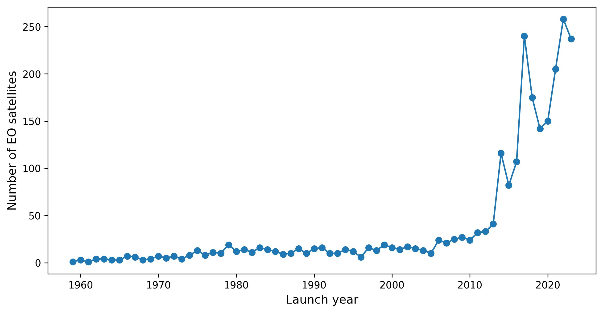
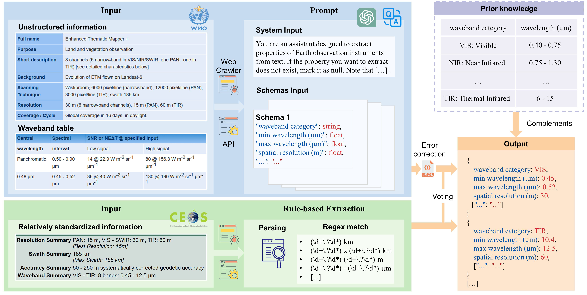

# 全球民用地球观测卫星语义数据库 (GEOSatDB)

[**English**](./README.md) | [**中文**](./README_CN.md)

地球观测遥感卫星具有大范围覆盖、规律性重访、持续性观测等特征，已在自然资源管理、全球变化应对等方面发挥重要作用。本研究采用自动化处理和人工复核相结合的方法，从公开可访问的11个卫星和传感器信息库中，经过提取、融合和标定，构建了全球民用领域规模最大的地球观测卫星语义数据库 (GEOSatDB)，能够增强地球观测资源的可发现性和语义互操作能力，并支撑地球观测资源的语义共享和知识服务。

## 研究背景

地球卫星遥感观测通过反演关键的地球环境变量，为全面理解地球系统状态、评估人类活动影响、推动全球环境和社会可持续发展提供了至关重要的基础性信息。经过六十余年的发展，全球已经部署数千颗地球观测卫星。然而，这些宝贵资源分散在不同国家和组织，以各自独立的方式维护，为有效利用全球地球观测资源并充分发挥其潜能带来了严峻挑战。

## 研制方法

GEOSatDB的构建流程包含两个阶段：地球观测卫星和传感器的本体模型设计、卫星与传感器信息的提取、融合和标定。

首先，本文遵循W3C推荐的RDF技术栈、对齐ISO 19115和19130等地理信息国际标准、采用SKOS和Schema.org等通用元数据规范，构建了地球观测卫星、星载传感器、工作波段和运行模式四类本体模型。

其次，本文采用国际卫星标识符关联、发射时间信息对齐和名称文本相似匹配的方法，实现已有多种重要开源卫星数据库的信息提取和融合。然后，通过设计有效的提示策略，利用大语言模型完成空间分辨率、光谱范围等传感器重要信息的自动化提取，并通过基于信息匹配度的投票机制，实现来自不同数据库中的卫星和传感器信息的融合。最后由领域专家进行审核、修正和补充，获得了完整和精确的卫星和传感器语义表达结果。

## 数据描述

[GEOSatDB门户网站](https://www.geosatdb.cn)现已开发完毕，它提供了一个互动性强、操作简便的界面，以便用户高效检索地球观测卫星及传感器资源。

GEOSatDB数据库遵循CC BY-NC 4.0协议，采用标准的RDF Turtle格式在[ScienceDB](https://doi.org/10.57760/sciencedb.11805)上开放共享。数据集包含四个Turtle文件：

- GEOSatDB_ontology.ttl: 概念、关系和属性的本体建模；
- satellite.ttl: 2,453 颗地球观测卫星及其关联实体；
- sensor.ttl: 1,035 颗星载传感器及其关联实体；
- sensor2satellite.ttl: 卫星和传感器的关联关系。

该数据库未来将每季度更新一次，实现多源信息融合和质量检查。

## 引用信息

Ming Lin, Meng Jin, Juanzi Li & Yuqi Bai (2024). GEOSatDB: global civil earth observation satellite semantic database, Big Earth Data, DOI: [10.1080/20964471.2024.2331992](https://doi.org/10.1080/20964471.2024.2331992)